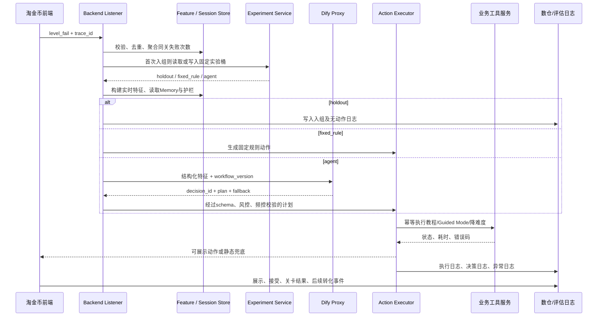

# 端到端数据流与 Backend 执行设计

## 当前可执行范围

交付包已在 Render Mock Backend 中实现可运行的七阶段链路：

`前端埋点 -> Backend 监听与去重 -> 稳定实验分桶 -> 特征标准化 -> 分组策略决策 -> Mock 工具执行 -> 临时数仓回流记录`

测试入口为看板的“在线测试 -> 端到端 Pipeline Mock”，接口为 `POST /api/v1/pipeline/test`。该实现用于接口、状态和异常闭环验收；实验平台、Dify、游戏配置服务与数仓仍为内存或 Mock 实现，不构成生产接入。

## 1. 实时调用流程



## 2. 后端判定与分流伪代码

```text
on level_fail(event):
  validate schema, server timestamp, trace_id and deduplicate(event_id)
  state = increment_same_level_fail(user, session, level_id)
  if event.game_variant != "standard" or event.level_id != 2:
      return record_only()

  assignment = get_or_assign(user_id_hash, experiment_id, strata)
  write_enrollment_once(assignment, first_eligible_time)

  if assignment == "holdout":
      write_decision(status="no_action", reason="holdout")
      return
  if assignment == "fixed_rule":
      plan = tutorial_if_first_fail_else_guided_mode(state)
  else:
      features = build_features(event, state, memory, guardrails)
      plan = call_dify_with_timeout(features, 1500ms)
      plan = validate_plan_or_fallback(plan)

  execute_each_action_idempotently(plan)
  write_decision_execution_and_frontend_delivery_logs()
```

## 3. 工具映射、异常和兜底

| Agent 动作 | Backend 业务接口 | 超时 | 幂等键 | 失败处理 |
|---|---|---:|---|---|
| `show_tutorial` | `tutorial_service.show` | 500ms | `decision_id:tutorial` | 前端展示本地静态提示 |
| `switch_guided_mode` | `game_config_service.switch_mode` | 500ms | `decision_id:mode` | 保持原模式，记录 `mode_switch_failed` |
| `reduce_difficulty` | `game_config_service.set_difficulty` | 500ms | `decision_id:difficulty` | 保持原难度，展示提示；不重试超过一次 |
| `grant_coin_compensation` | `coin_service.grant` | 800ms | `decision_id:coin` | 写 `pending`，下次活跃异步补发 |
| `issue_coupon` | `coupon_service.issue` | 800ms | `decision_id:coupon` | 写 `pending`，不阻塞游戏 |
| `show_recommendation` | `recommendation_service.get` | 600ms | `decision_id:rec` | 返回默认推荐卡 |

首期 Level 2 A/B 不启用金币和优惠券，以避免成本与激励对主指标的干扰。

## 4. 接口补充要求

既有 `/v1/features/build`、`/v1/agent/decision`、`/v1/tools/execute`、`/v1/memory/read`、`/v1/memory/write`、`/v1/eval/log` 外，线上实验还需：

| API | 目的 | 关键请求字段 |
|---|---|---|
| `POST /v1/experiments/assign` | 首次入组时固定随机桶 | `user_id_hash, experiment_id, strata, assignment_seed` |
| `POST /v1/events/ingest` | 接收、去重、校验前端事件 | `event_id, trace_id, event_name, event_time, payload` |
| `POST /v1/interventions/delivery` | 前端确认展示与反馈 | `decision_id, action_type, delivery_status, feedback_type` |
| `POST /v1/eval/outcomes/backfill` | T+1/T+7 回填留存与交易结果 | `user_id_hash, experiment_id, outcome_date, metrics` |

上述四个接口已在交付包中提供内存 Mock，可用于请求格式和返回状态联调；上线前必须替换为持久化、可审计的真实服务。

## 5. 必须验收的非功能要求

| 项目 | 验收要求 |
|---|---|
| 一致性 | 同一 `user_id_hash + experiment_id` 永远返回同一分桶 |
| 幂等 | 同一 `idempotency_key` 不重复切模式、不重复发放权益 |
| 时延 | Listener P95 <= 300ms；Feature P95 <= 500ms；Dify P95 <= 1500ms |
| 可用性 | Dify 不可用时返回固定静态提示，前端不出现无响应状态 |
| 审计 | 100% 入组记录可关联到事件、决策、动作和结果；`trace_id` 不丢失 |
| 隐私 | 只传递 `user_id_hash`；不向 Dify 发送明文订单、地址或支付信息 |
